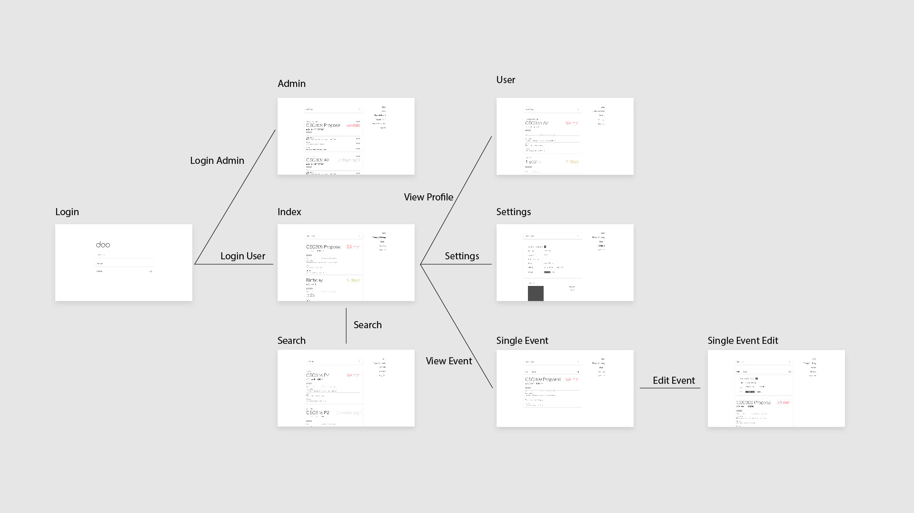
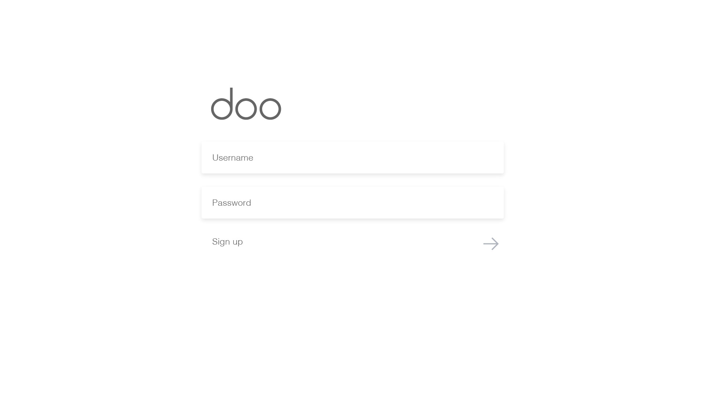
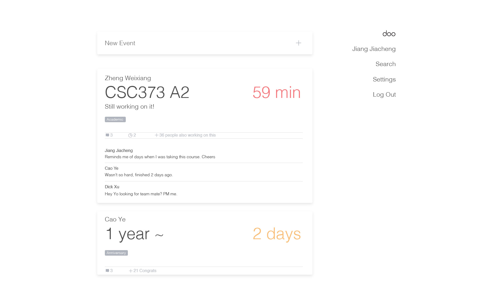
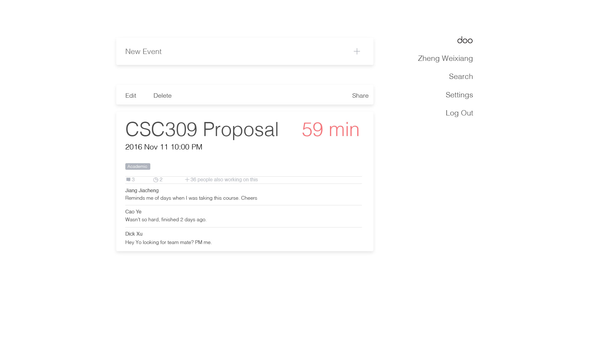
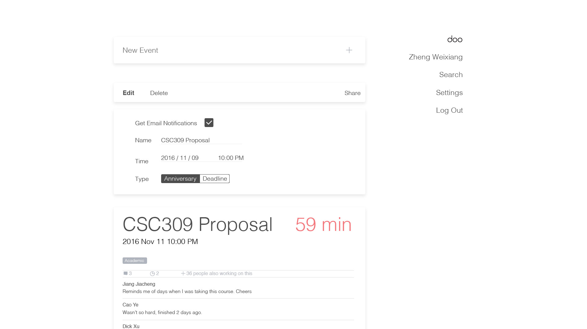
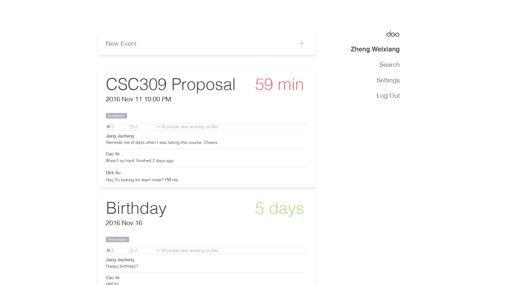
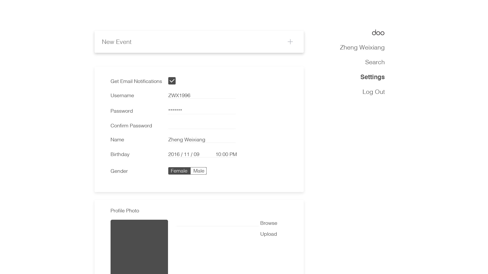

# doo

## Intro

Our goal is to build a social interactive online count down app. Users are able to view followed users' and themselves' special dates. Possible dates could be anniversaries and deadlines. Users are allowed to interact with others' special dates accordingly. For example, one can cheer up others' deadlines, and can send congrats to anniversaries. The app servers users who are interested in sharing their schedules with others. With this app, they will be able to view, share, comment and interact with other people's special dates. Events are also allow to be set to private. Users like students could use this platform to improve their time management efficiency.

## Interactions
### Users

- Sign up / delete a account with email, username and password
- Login / Log out
- Add / delete / edit a event with dates, event name, type
- Edit profile
- Follow / unfollow users
- View followed users' events
- View one's own events
- +1 on other users' events (different meanings according to events, e.g. for deadlines, +1 means to cheer up, and for anniversaries, +1 means congrats)
- if deadline, user can add the event to their own list
- Comment on events
- Delete one's own comments
- Subscribe email notifications
- Search (by username / date / keyword / category)

### Admins
- Delete Users
- Delete Events
- Delete (inappropriate) Comments
- Add Events for users to Add

## Properties
#### User
- username (id)
- password (probably a hashed value)
- birthday
- name
- gender
- email
- email notification (boolean)
- comments (list of comment id)
- events (list of event id)

#### Event
- id
- title
- time (date)
- type
- owner
- private / public
- email notification (boolean)
- comments (list of comment id)
- +1 value
- share value (if deadline, how many users are also working on it)

#### Comment
- id
- content
- username
- timestamp

## Sketeches
### Site Navigation design

### Login

### Admin

### Index

### Single Event

### Single Event edit

### User

### Search

### Settings / Signup

